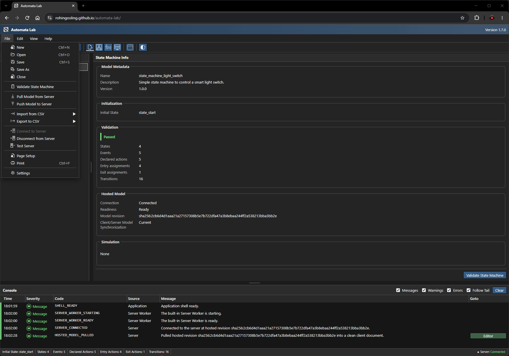

# Automata Lab


<p align="center">
  
</p>

<p align="center">
  <strong>An experimental sandbox for deterministic Moore-machine state transducers.</strong><br>
  Infer, author, visualize, host, and simulate state-transducer models directly in the browser.
</p>

<p align="center">
  <a href="https://rohingosling.github.io/automata-lab/"><strong>💻 Open Automata Lab</strong></a> &nbsp; ▪&nbsp;
  <a href="https://rohingosling.github.io/automata-lab/docs/"><strong>📄 Documentation</strong></a>
</p>

<a id="contents"></a>

## 📚 Contents

- [🔎 Overview](#overview)
- [🚀 Quick Start](#quick-start)
- [📊 State Machine (State Transducer) Model](#state-machine-model)
- [🧠 Partial-Observation Solver](#partial-observation-solver)
- [📝 Authoring and File Format](#authoring-and-file-format)
- [🖥️ Built-In Server](#built-in-server)
- [📖 Documentation](#documentation)
- [🛠️ Development](#development)
- [📄 License](#license)

<a id="overview"></a>

## 🔎 Overview

Automata Lab provides four connected workspaces for creating and investigating deterministic Moore-machine-inspired state transducers:

| Workspace | Purpose |
|---|---|
| **Editor** | Authors the model through structured forms, lists, action assignments, and a transition table. |
| **Chart** | Displays and edits the same model as a UML-like graph. |
| **Solver** | Infers a reviewable candidate from partial observations of states, events, and actions. |
| **Simulator** | Provides a means to emulate the server and query the state transducer. |

The application builds as a static React site for GitHub Pages. A dedicated browser Web Worker emulates the
state-machine server, while a separate terminable worker performs inference. The result retains a clear client/server
boundary without requiring installation or a remote service. The combined application and documentation are published
at [Automata Lab](https://rohingosling.github.io/automata-lab/).

<a id="quick-start"></a>

## 🚀 Quick Start

### Hosted Web Application

Open the [hosted Automata Lab application](https://rohingosling.github.io/automata-lab/). Its integrated
[documentation](https://rohingosling.github.io/automata-lab/docs/) includes the complete User and Developer Guides.

### Run Locally

Install `Git`, `Node.js`, and `npm`, then run these commands in PowerShell (the same commands work in most shells):

```powershell
git clone https://github.com/rohingosling/automata-lab.git
cd automata-lab/automata-web
npm ci
npm run dev
```

Open the local URL printed by Vite, normally [http://localhost:5173/automata-lab/](http://localhost:5173/automata-lab/). Press **Ctrl+C** in the terminal when you want to shut down the development server.

### Create Your First Model

1. Select **New** on the toolbar, or press **Ctrl+N**, to create an in-memory model.
2. In **Editor**, add at least one state, choose the initial state, then add any events and reusable actions you need.
3. On the selected state's **Entry Actions** and **Exit Actions** tabs, assign outputs in the order they should be reported.
4. Build the partial deterministic transition function in **Transition Table**, or create the same transitions visually in **Chart**.
5. Open **State Machine** and select **Validate State Machine**. Follow any diagnostics shown there and in the Console.
6. Use **Chart → Automatic Layout** to inspect the model, or enter partial observations in **Solver** to infer a reviewable candidate.
7. Select **Save As** whenever you want to preserve the portable JSON project. If no states or initial state have been defined yet, Automata Lab lists those requirements in a warning and can still save after confirmation; hosting and simulation still require a complete valid model.

Nothing is uploaded by merely opening or editing a model. Until you explicitly save, the authoring document remains in the browser page's volatile memory.

<a id="state-machine-model"></a>

## 📊 State Machine (State Transducer) Model

Automata Lab implements an extended [Moore machine](https://en.wikipedia.org/wiki/Moore_machine). Its deliberate extension is to define two state-only output functions, one for entry-action output and one for exit-action output, in place of the standard Moore machine's single output function.

For strict Moore-machine operation, assign only entry actions and no exit actions. With only entry actions assigned and no exit actions assigned, the Automata Lab model is then mathematically equivalent to a Moore machine.

**Standard Moore-Machine State-Transducer Definition**

A Moore machine is defined as the six-tuple:

$$
M = \left(S, s_0, \Sigma, \Lambda, T, G\right),
$$

where $S$ is a finite set of states, $s_0 \in S$ is the initial state,
$\Sigma$ is the input alphabet, $\Lambda$ is the output alphabet,
$T : S \times \Sigma \to S$ is the transition function, and
$G : S \to \Lambda$ is the state-only output function.

**Automata Lab's Moore-Machine Inspired State-Transducer Definition**

Automata Lab uses the corresponding seven-tuple, replacing the standard [Moore machine](https://en.wikipedia.org/wiki/Moore_machine) output function $G$ with $G_{\mathrm{entry}}$ and $G_{\mathrm{exit}}$.

$$
M_{\mathrm{AL}} =
\left(S, s_0, \Sigma, \Lambda, T,
G_{\mathrm{entry}}, G_{\mathrm{exit}}\right),
$$

with a partial deterministic transition function and two state-only output-word functions:

$$
T : S \times \Sigma \rightharpoonup S,
\qquad
G_{\mathrm{entry}} : S \to \Lambda^*,
\qquad
G_{\mathrm{exit}} : S \to \Lambda^*.
$$

Here, $\Lambda^*$ is the set of finite words over the action alphabet, including the empty word $\varepsilon$. Consequently, output order and repeated action symbols are part of the model.


---

### States


A finite, non-empty set of states. It contains one or more states because a [finite-state transducer](https://en.wikipedia.org/wiki/Finite-state_transducer), including a Moore machine, has an initial state.

$$
S = \{s_1, s_2, \ldots, s_n\},
\qquad 1 \le n < \infty.
$$

---

### Initial State

$$
s_0 \in S.
$$

---

### Events

A list of zero or more events.

$$
\Sigma = \{\sigma_1, \sigma_2, \ldots, \sigma_m\},
\qquad 0 \le m < \infty.
$$

---

### Actions

A list of zero or more reusable actions. The entry- and exit-output functions associate ordered action words with states.

$$
\Lambda = \{\lambda_1, \lambda_2, \ldots, \lambda_k\},
\qquad 0 \le k < \infty.
$$

---

### Transition Function *(Transition Table)*

A partial deterministic transition function, implemented in **Automata Lab** as a transition table. Each state/event pair has at most one destination. An undefined pair leaves the current state unchanged and produces a warning.

$$
T : S \times \Sigma \rightharpoonup S.
$$

The standard Moore definition uses the total form $T : S \times \Sigma \to S$; Automata Lab deliberately permits a partial function for experimental models.

---

### Output Function(s)

An output function to map states to entry actions, and an output function to map states to exit actions.

$$
G_{\mathrm{entry}} : S \to \Lambda^*.
$$

$$
G_{\mathrm{exit}} : S \to \Lambda^*.
$$

For a standard Moore output function $G : S \to \Lambda$, the equivalent Automata Lab functions are

$$
G_{\mathrm{entry}}(s) = \langle G(s) \rangle,
\qquad
G_{\mathrm{exit}}(s) = \varepsilon.
$$


---

### Operation

When an event causes a transition from $s$ to $s' = T(s, \sigma)$, the runtime reports the output word

$$
G_{\mathrm{exit}}(s) \mathbin{\cdot} G_{\mathrm{entry}}(s'),
$$

where $\cdot$ denotes concatenation. Repeated action assignments remain meaningful and retain their order. A self-transition reports the state's exit actions and then its entry actions because the machine exits and re-enters that same state.

An unknown event or a defined event without a transition produces a warning and leaves the state unchanged. During **Run**, later buffered events continue.

**Reset** returns a session to its initial state, clears its traces, and emits nothing. The next **Run** or **Step** emits the initial entry actions once. A session whose event buffer becomes empty remains Running at its current state so another sequence can continue it.

<a id="partial-observation-solver"></a>

## 🧠 Partial-Observation Solver

The Solver infers a compact deterministic candidate consistent with every supplied observation. It uses [constrained state merging](https://doi.org/10.1007/BFb0054059) in the evidence-driven/red-blue family. Because finite partial evidence rarely identifies one unique machine, the Solver presents its result as a candidate with provenance and assumptions rather than as a uniquely correct or globally minimal answer.

Solver text uses explicit token prefixes:

- `event_...` identifies an observed event;
- `state_...` identifies an observed state;
- `action_...` identifies an observed action.

For easier entry and pasted notes, Event, State, and Action classifiers may also use title or uppercase spelling and `_`, `-`, or whitespace separators; compact forms such as `EventOpen` are accepted. Automata Lab canonicalizes the classifier to `event_`, `state_`, or `action_` before inference while preserving the name suffix.

Each saved sequence declares one starting context: `initial`, `continuation`, or `infer`.

Events delimit transition steps. State and action tokens before the first event describe the starting state. State and action tokens between two events describe the destination reached by the preceding event. State and action tokens may be interleaved, while action order remains significant. The actions within an interval form that destination state's complete ordered entry-action list; an interval without actions describes an empty list.

Every observation is a hard constraint. Conflicting explicit states, incompatible complete action lists, or incompatible deterministic destinations produce explained diagnostics and no candidate. The Solver merges compatible evidence and invents hidden states when necessary, while reporting every weakly supported or invented structure. Unobserved state/event pairs remain undefined, and Solver-generated exit-action lists remain empty.

A successful candidate remains immutable during review. Candidate Review includes a summary, read-only Chart, state/action tables, transition provenance, trace coverage, inference report, and comparison with the current model. A separately confirmed **Apply** command replaces the local model as one undoable operation. Apply does not save or push the document.

<a id="authoring-and-file-format"></a>

## 📝 Authoring and File Format

Solver, Editor, and Chart operate on one in-memory authoring document. Editor provides the complete data-centric and keyboard-accessible workflow. Chart has equal semantic write authority and dispatches the same model commands. Moving a state preserves the current Chart pan and zoom after release. PNG/JPG Chart export defaults to a configurable 1,000-megapixel pre-allocation ceiling, adjustable from 1 through 1,000 under **Application Settings → Chart → Image Export**.

Incomplete drafts remain editable in memory. A structurally sound project can be saved with zero states and/or no initial state after an explicit warning; reopening it shows the same missing requirements in a dialog and in the Console. Malformed structure, invalid metadata, duplicates, dangling references, and other integrity errors still block loading or saving. Push, simulation, and Solver Apply become available only when complete semantic validation passes. Renames update every reference atomically. Deletions present their complete impact and remove dependent references as one undoable change.

The **File → Import from CSV** and **Export to CSV** submenus include one-record **Model Metadata** transfer using `name,description,version,initial_state`. Transition Table imports identify undeclared state and event names in separate selectable, read-only text areas for easy copying, while every import failure and warning is also recorded in the Console.

Automata Lab uses strict UTF-8 JSON with this top-level identity and structure:

```json
{
  "file_id": "automata-lab-state-machine",
  "file_version": "1.0.0",
  "settings": {},
  "state_machine": {},
  "chart": {},
  "solver": {},
  "simulator": {}
}
```

The nested members are validated strictly. Automata Lab rejects unknown properties, duplicate JSON members, dangling references, duplicate transition keys, unsupported versions, and exceeded limits before replacing the current document. Chart settings and placement are portable document data.

**Save Backup** defaults off. When it is enabled, a file adapter with the required capability may replace a sibling `.json.bak` with the previous file content before saving. A browser that cannot create that sibling silently saves the current JSON once and records `FILE_BACKUP_SKIPPED` in the Console; it does not open a folder picker, download a second `.bak` file, or show a backup-warning dialog. Save uses its associated handle where available, and Save As uses one native save-file picker or one download fallback.

<a id="built-in-server"></a>

## 🖥️ Built-In Server

The browser-local server owns one immutable hosted document revision and any active isolated simulation sessions. The client owns the authoring document. The two communicate only through a validated, bounded, versioned gateway.

The **File** menu provides Connect, Disconnect, Test Server, Pull, and Push commands. **Push** validates and conditionally replaces the hosted head revision. **Pull** retrieves that revision while protecting dirty local work. Ordinary editing and Solver Apply affect only the client document.

Each simulation session pins the revision active when the session is created. A later Push does not mutate the existing session; the application marks it stale while allowing it to continue or Reset against its pinned snapshot. Closing it and creating a new session captures the current hosted revision.

The built-in transport remains local to the browser page. Its HTTP-shaped operations keep the client gateway compatible with an external HTTP transport adapter.

| Operation | HTTP semantic |
|---|---|
| Handshake | Capability and protocol negotiation. |
| Liveness/readiness | `GET /api/v1/health/live` and `GET /api/v1/health/ready`. |
| Pull model | `GET /api/v1/model`. |
| Conditional Push | `PUT /api/v1/model`. |
| Start session | `POST /api/v1/sessions`. |
| Run or Step | `POST /api/v1/sessions/{id}/run` or `/step`. |
| Reset session | `POST /api/v1/sessions/{id}/reset`. |
| Close session | `DELETE /api/v1/sessions/{id}`. |

<a id="documentation"></a>

## 📖 Documentation

The live [documentation home](https://rohingosling.github.io/automata-lab/docs/), task-oriented
[User Guide](https://rohingosling.github.io/automata-lab/docs/user-guide/), and implementation-focused
[Developer Guide](https://rohingosling.github.io/automata-lab/docs/developer-guide/) build into the same GitHub Pages
artifact as the application and require no hosted documentation service at runtime. Their public sources live in
[`documentation/`](documentation/).

<a id="development"></a>

## 🛠️ Development

### Prerequisites

- Node.js 24.15.0
- npm 11.12.1
- Playwright-supported operating-system libraries for Chromium, Firefox, and WebKit browser testing

The committed repository contains every asset needed to build and test the application. Access to a complete external Fluent icon collection is required only when adding or refreshing the curated Fluent subset.

### Commands

The application package is in `automata-web/`. Run npm commands from that directory.

| Command | Purpose |
|---|---|
| `npm ci` | Installs the exact locked dependency graph. |
| `npm run dev` | Starts the Vite development server. |
| `npm run icons:check` | Verifies the exact curated Fluent icon set and its hashes. |
| `npm run icons:import -- --source <directory>` | Imports the selected Fluent icons from an external master collection. |
| `npm run audit:runtime` | Verifies the lockfile-derived production closure and committed complete license inventory without network access. |
| `npm run audit:runtime:write` | Mechanically regenerates the runtime notice after an intentional reviewed dependency change. |
| `npm run audit:advisories:offline` | Queries only npm advisory data already present in the local cache; it is not a live advisory check. |
| `npm run typecheck` | Runs strict TypeScript checks. |
| `npm run lint` | Runs ESLint. |
| `npm run test:unit` | Runs all Vitest suites. |
| `npm run test:model` | Runs Phase 1 file, validation, command, runtime, Solver-observation, hashing, and property tests. |
| `npm run test:solver` | Runs Solver-focused Vitest suites. |
| `npm run test:shell` | Runs shell-focused Vitest suites. |
| `npm run test:browser:install` | Non-interactively installs the Chromium, Firefox, and WebKit revisions pinned by Playwright 1.62.1. |
| `npm run test:browser` | Runs Playwright browser tests. |
| `npm run test:accessibility` | Runs the dedicated accessibility browser suite. |
| `npm run build` | Builds and audits the application artifact. |
| `npm run build:pages` | Builds and verifies the combined application and documentation Pages artifact. |
| `npm run test:artifact` | Audits an existing production artifact. |
| `npm run preview` | Serves the audited production build locally. |
| `npm run verify` | Runs application, documentation, combined-artifact, and browser verification. |

After `npm ci` on a clean host, run `npm run test:browser:install` before the browser suite. This invokes the
package-local Playwright 1.62.1 CLI, not a global or newly resolved CLI, so its Chromium, Firefox, and WebKit revisions
remain synchronized with `package-lock.json`. The command is non-interactive; it requires network access only when the
matching browser cache is absent.

From the repository root, `build.bat` performs the locked dependency install, the pinned Playwright browser install,
and the complete verification/build workflow while preserving the underlying exit status.

The committed `package.json` and `package-lock.json` pin every dependency version. The production build targets the `/automata-lab/` GitHub Pages subpath.

The Fluent icon selection is declared in `assets/images/icons/fluent-icons.json`. Imported project copies live in `assets/images/icons/fluent/`; Vite serves them during development and emits only that curated subset into the production artifact. The external master collection is never required by CI, promotion, deployment, or application runtime.

<a id="license"></a>

## 📄 License

- The Automata Lab application is released under the [MIT License](LICENSE).
- The curated Microsoft Fluent UI System Icons are distributed under Microsoft's
  [Fluent UI System Icons MIT licence](automata-web/public/notices/fluent-ui-system-icons.txt).
